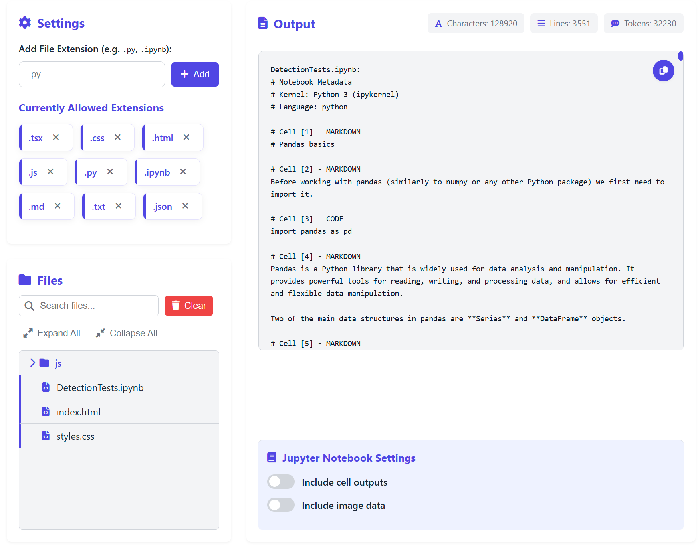

# Codeigest

**Codeigest** is a browser-based tool that helps developers extract, view, and compile code across multiple files and projects. It processes all files locally in your browser, ensuring your code and data remain private.

## Features
- **100% Local Processing** - All files are processed in your browser, nothing is sent to servers
- **Directory & File Support** - Drop entire folders or select individual files
- **Customizable Extensions** - Add or remove file extensions to filter content
- **File Search** - Quickly find files in your project 
- **Content Metrics** - Track character, line, and token counts
- **Dark Mode** - Switch between light and dark themes
- **Jupyter Notebook Support** - Process .ipynb files with control over outputs and images
- **Local Storage** - Your preferences are saved between sessions

## Installation
Codeigest is a client-side web application with no backend dependencies. To run it locally:
1. Clone this repository:
   ```bash
   git clone https://github.com/username/codeigest.git
   cd codeigest
   ```
2. Start a local server:
   Using Python (simplest option):
   ```bash
   # For Python 3
   python -m http.server 8000
   
   # Or for Python 2
   python -m SimpleHTTPServer 8000
   ```
   Using Node.js:
   ```bash
   # Using npx and serve
   npx serve
   ```
3. Open your browser and navigate to:
   ```
   http://localhost:8000
   ```

## Usage
1. **Upload Files**: Drag and drop folders or files, or use the file selector
2. **Manage Extensions**: Add or remove file extensions to control which files are included
3. **Navigate**: Use the file explorer to browse and preview individual files
4. **Export**: Copy the combined content for documentation or AI assistance

## Privacy
Codeigest is designed with privacy as a core principle:
- All file processing happens directly in your browser
- No data is ever sent to any server
- File content remains on your device at all times
- Preferences are stored only in your browser's local storage
- No analytics or tracking mechanisms are implemented

## Use Cases
- Prepare code for documentation
- Share project context with AI assistants
- Consolidate multiple source files for analysis
- Create project summaries for team communication
- Extract relevant portions of a codebase

## Deployment
To deploy to production:
1. Host the static files on any web server, CDN, or static hosting service
2. Recommended platforms: GitHub Pages, Vercel, Netlify, or any static file host

Example for GitHub Pages:
```bash
# After setting up GitHub Pages in repository settings
git push origin main
```

## Technologies
- Pure JavaScript (no framework dependencies)
- HTML5 & CSS3
- Local Storage API for persistence
- FileReader API for local file processing

## Browser Support
- Chrome/Edge (Recommended)
- Firefox
- Safari

## License
MIT License - See LICENSE file for details.

## Contributing
Contributions are welcome! Please feel free to submit a Pull Request.
1. Fork the repository
2. Create your feature branch (`git checkout -b feature/amazing-feature`)
3. Commit your changes (`git commit -m 'Add some amazing feature'`)
4. Push to the branch (`git push origin feature/amazing-feature`)
5. Open a Pull Request

## Contact
For questions or feedback: [contact@codeigest.com](mailto:contact@codeigest.com)
